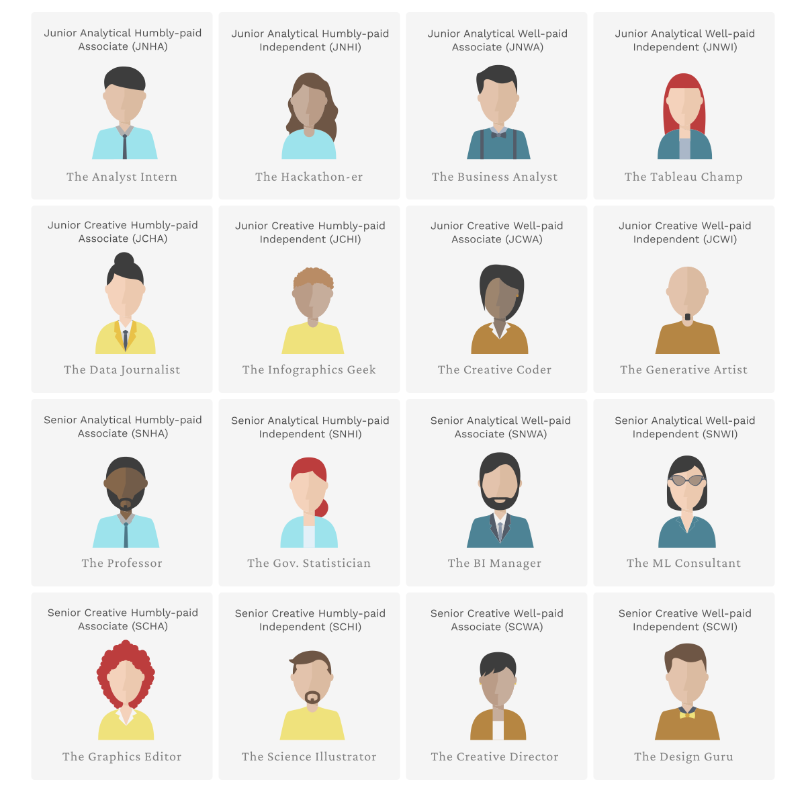
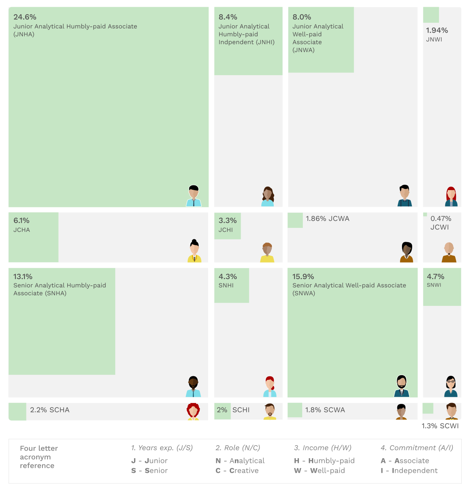
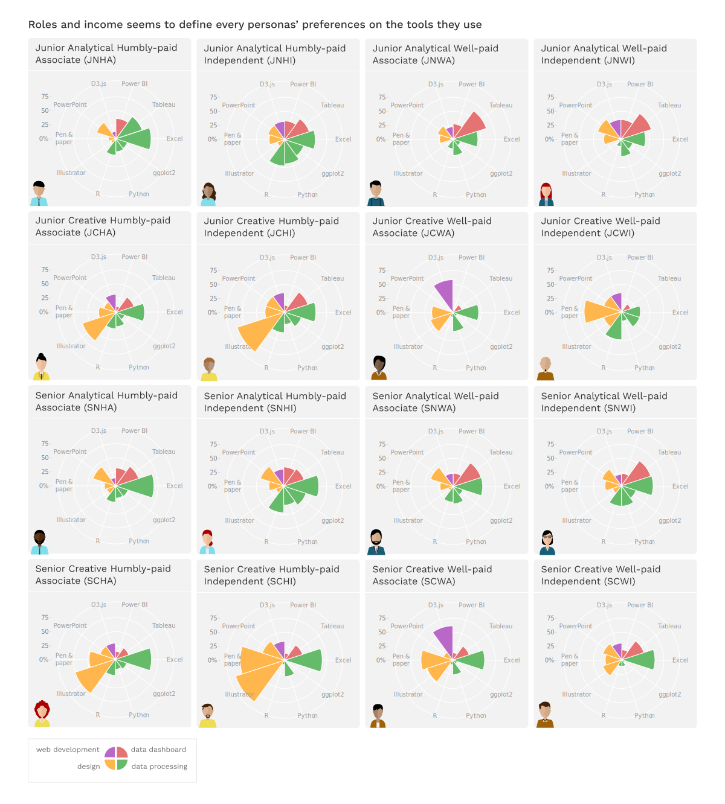
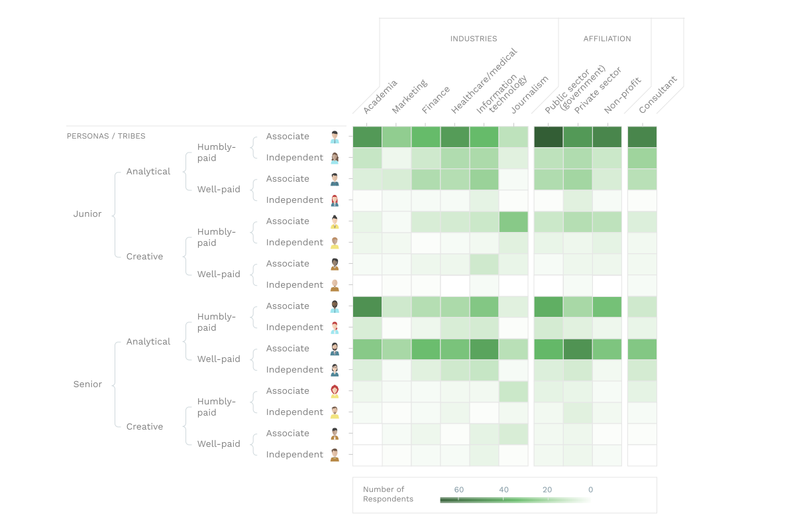
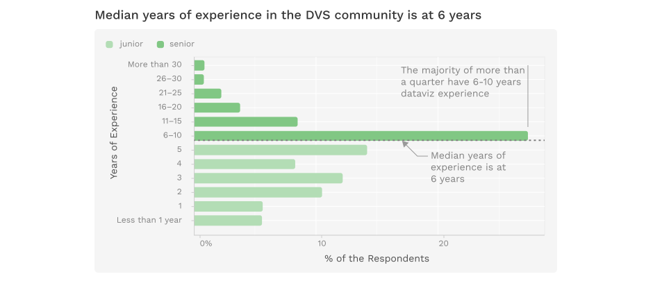
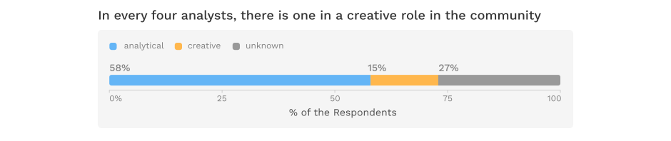
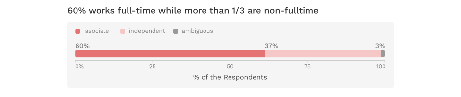

BY JOSEPH RICAFORT

If you haven't taken the quiz yet, know which DVS persona are you by taking the [quiz here](https://dvs-persona-quiz.thelostkite.com/).

The DVS community is a diverse community made up of dataviz practicioners from different demographics and experiences. Have you ever wondered what could be the different possible personas that are made up of this community and which of these personas do you identify yourself the closest to?

Let's look at the 4 different indicators and mix & match them to create different personas of what the DVS population are made out of.


[Cartoon Vectors by Vecteezy](https://www.vecteezy.com/free-vector/cartoon)

*Disclaimer: The naming or alias for every persona (e.g. The Analyst Intern, The Journalist, etc..) were inferred from the data as close as possible but might not truly represent and characterize the majority of those subgroups. It is also a means to easily identify the subgroups with this naming convention.*

Among 2,165 survey respondents, 1,288 have provided all of the **4 major indicators** and have answered at least one of the **4 additional indicators**.

**4 major indicators:**

* **Years of experience** (Junior vs Senior)
* **Role** (Analytical vs Creative)
* **Income group** (Humbly-paid vs Well-paid)
* **Commitment** (Independent vs Associate)

**4 additional indicators:**

* **Tools for DVS** - identifies the character for each persona in terms of tool preference
* **Organizations / Industry** - distribution of the personas to which they are more common
* **Frustrations** - do each persona have varying frustrations?
* **Issues** - socio-economic or dvs-specific issues for each persona

If you want to read first the full methodology on how the classifications were done or how the numbers were crunched, see the [Methodology and the 4 Major Indicators Comparison].

## The 16 DVS Personas

Mix and matching these 4 major indicators, 16 unique personas were created. This is somewhat inspired from Myers-Briggs Type Indicator (MBTI) but with a DVS twist!

**Percentage distribution of the 16 DVS personas**


```{r, echo=false}
tribe_tally %>%
  select(-n) %>% rename(percent = nPerc) %>%
  mutate(percent = round(percent, 2))
```

25% of the DVS community is a Junior-Analytical-Humblypaid-Associate, the most common among all personas. It is then followed by a Senior-Analytical-Humblypaid-Associate.

Meanwhile a Junior-Creative-Wellpaid-Independent is the rarest persona which is just 0.5% of the DVS members. Imagine a dataviz practitioner who has less than 6 years experience with more than USD80,000 annual salary who is either a freelance or a part-time student. They seem to be like prodigy, free spirited, fast-learning entrepreneurs doing things their way and being paid really well.


## The Preference and Character of Each Persona (4 Additional indicators)

4 variables from the survey data were chosen to see what distinct character each of the persona inhibit. These are:

**The 2 additional indicators:**

* **Tools for DVS** - identifies the character for each persona (**ToolsForDV_**)
* **Organizations / Industry** - distribution of the personas to which they are more endemic (**OrgSector_**)
<!-- * **Frustrations** - do each persona have varying frustrations? (**TopFrustrationsDV_**) -->
<!-- * **Issues** - socio-economic or dvs-specific issues for each persona (**TopIssuesDV_**) -->
```{r, echo=false}
tribe_tools
tribe_frustrations
```

### Which tools each persona more likely use?

Let's look at how each persona has more prefered tools than the others.

** Observations **
* Among the junior-analyticals, the humblypaids' use excel as top tool while the wellpaids' use Tableau. Does this imply that Tableau is for the well-offs among the junior analyticals?
* Humblypaid creatives proudly shows their affinity for illustrator and it's just so obvious with the charts.
* Unanimously, any persona seems to use Excel as their top tool for DV.
* Junior creative independents tend to use R as either 2nd or 3rd tool.
* Creative-Wellpaid-Associates are D3.js power users! Who said creatives can't code?
* Looks so obvious that Illustrator is a creative's bestfriend, except for a creative-wellpaid-independent which a Junior would prefer Pen & paper and Senior uhm... Excel? strange.

```{r, fig.width = 10, fig.height = 10, echo=false}
# ggplot(tribe_tools %>% 
#          ungroup() %>%
#          group_by(tribe_desc) %>%
#          top_n(5, n) %>% ungroup(), aes(tools_for_dv_vars, percN, color = tribe_desc)) +
#   geom_point() +
#   coord_flip()
```


### How common each persona per industry?

Different personas were dispersed in different industries asymmetrically. This visual tool could be beneficial if you are eyeing for a specific persona you want to be in. A rare persona in that industry could either indicate whether it has a difficult prerequisites which makes these persona quite rare.



**Observations**

* Junior-Analytical-Humblypaid-Associate seems to visually occupy a lot of the bars followed by Senior-Analytical-Wellpaid-Associate. These two personas earlier were ranked as the first and second most common personas.
* Almost 50% of the Senior-Analytical-Humblypaid-Associates identified themselves coming from the Academe.
* If you want to be a creative but want to earn a lot of money, you should be in the IT Industry, said by a Creative-Wellpaid.
* Most of those in the Journalism industry are either Junior-Creative-Humblypaid

------

## Methodology and the 4 Major Indicators Comparison

Let's look at our first major indicator, an indicator identifying your veteranship in the community!

### Years of experience (Junior vs Senior)
Do you lean more towards being a newbie or do you lean more towards being an experienced one? We look at the years of experience as the seniority indicator of how long you've been practicing dataviz work.

This indicator uses the **YearsDVExperience** variable. **YearsWorkExperience** is secondary variable when no YearsDVExperience was provided.

The median years of experience is **6 years**. Let's define you as a **Junior** if your DV experience is less than 6 years, while being a **Senior** if it is more than 6 years.



### Role (Analytical vs Creative)

Around 58% of the DVS members lean towards analytical roles while only 15% lean towards the creative roles.  A huge chunk of 27% chose to not indicate their roles.

This indicator uses **RoleAsEmployee** as the primary variable. When this variable is not provided by the respondent, the **RoleAsFreelance** is being accessed.

While roles usually require to be both creative or analytical in function and purpose, we attempt to classify roles that are more likely leaning towards either of them.

#### Analytical
Roles that lean more toward analytical or science related fields:

* **Analyst**
* **Developer**
* **Scientist**
* **Engineer**
* **Leadership (Manager, Director, VP, etc.)**

#### Creative
Roles that lean more towards creative or humanities related fields:

* **Designer**
* **Journalist**
* **Teacher**
* **Cartographer**

Note: Leadership and Cartographer roles tend to be ambiguously either creative or analytical, also as much as other roles. For the sake of removing the ambiguity, we tried to judge based on the reality and nature of the profession.

Stories that helped on how they were classified:

* [Creativity and the Role of the Leader](https://hbr.org/2008/10/creativity-and-the-role-of-the-leader)
* [A Day in the Life of an Ordinance Survey Cartographer](https://geoawesomeness.com/cartography-career-gis-skills/)

**58% are Analyticals while 15% are Creatives**



### Income group (Humbly-paid vs Well-paid)

Median annual income in the DVS community is at **$81,300**. 

Let's define you as **humbly-paid** if your annual income falls below the median annual income and **well-paid** if above it. We try to define these terms in respect to the entire DV population.

This indicator was taken from **PayAnnual** variable.

Note: The terms *humbly-paid* and *well-paid* depicts the lower and upper halves of the distribution. These terms could be subjective to every DVS member depending on their cost of living in their respective countries and other such factors.


### Commitment (Independent vs Associate)

#### Independent

Independents are those who are free-spirited dataviz practicioners working most likely on their own terms (e.g. freelancers, hobbyists). Based from the survey data, these includes:

* **Freelance/Consultant/Independent contractor**
* **Non-compensated data visualization hobbyist**
* **Student in a degree program at a college or university**
* **Passive income from data visualization related products**

#### Associate
Associates are those who are mostly working in an organization (e.g. employees) with dataviz responsibilities. They are those who have/are:

* **Position in an organization with some dataviz job responsibilities**
* **Academic/Teacher**

#### How we classified who belongs to which?
We put weighted points on variables where a respondent has indicated that they identified themselves working on these type of roles.

Since the majority has indicated working in a position in an organization (**DVRoles_Employee**), Weight points were included on the hobbyists and freelance roles to balance out the heavy-leaning towards an employee persona. This also removes the ambiguity that either can be classified from the other.

Then, these points were added and compare the results whichever is higher. This is now our metric that would indicate whether an individual lean towards either an **Independent** persona or an **Associate** persona.

**Independent**

* **+3** if has identified as hobbyist (**DVRoles_Hobbyist**)
* **+2** if has identified as freelance/consultant (**DVRoles_Freelance**)
* **+1** if has identified as student (**DVRoles_Student**)
* **+1** if has identified who has passive income (**DVRoles_PassiveIncome**)

**Associate**

* **+1** if has identified as employee (**DVRoles_Employee**)
* **+1** if has identified as teacher (**DVRoles_Academic**)

**Ambiguous**

* Those whose weighted points on both Independent and Associate scores were equal.


**Nearly 60% are Associates while around 37% are Independents**


```{css, echo = FALSE}
@import url("https://fonts.googleapis.com/css2?family=Crimson+Pro:ital,wght@0,300;0,500;0,600;1,500;1,700&family=Work+Sans:ital,wght@0,300;0,400;0,500;1,500&display=swap");

  h1,
  h2,
  h3, 
  h4 {
    font-family: "Crimson Pro", serif;
  }

  p,
  input,
  td,
  li {
    font-family: "Work Sans", sans-serif;
    font-size: 16px;
  }

```

